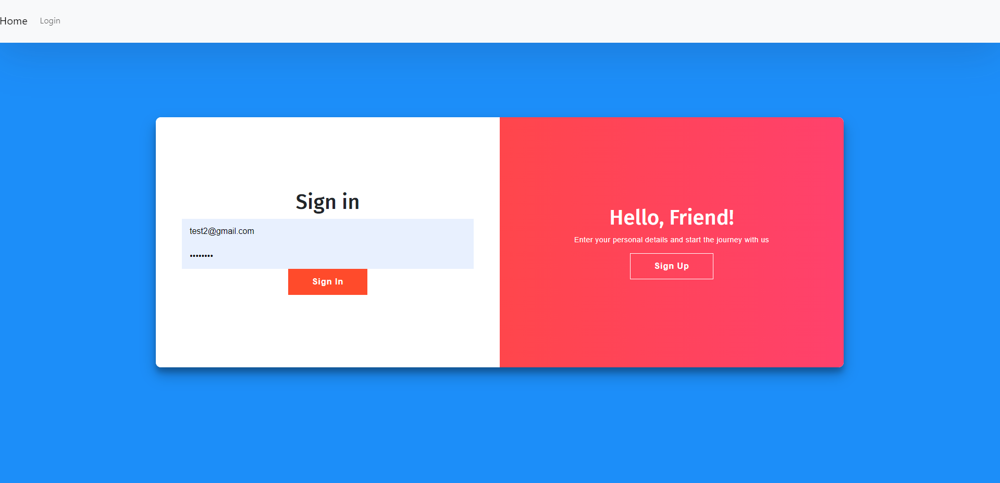
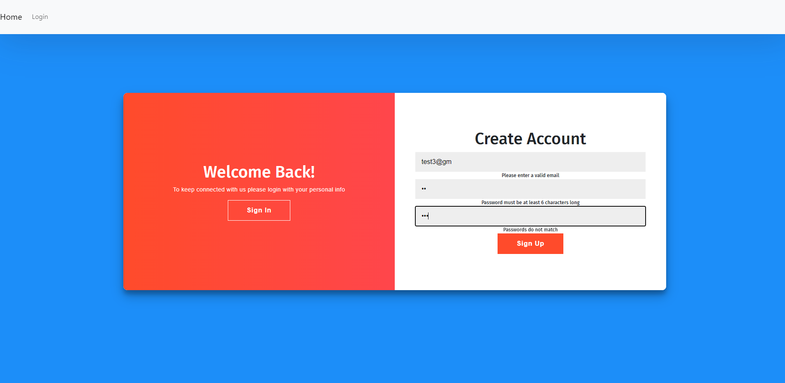
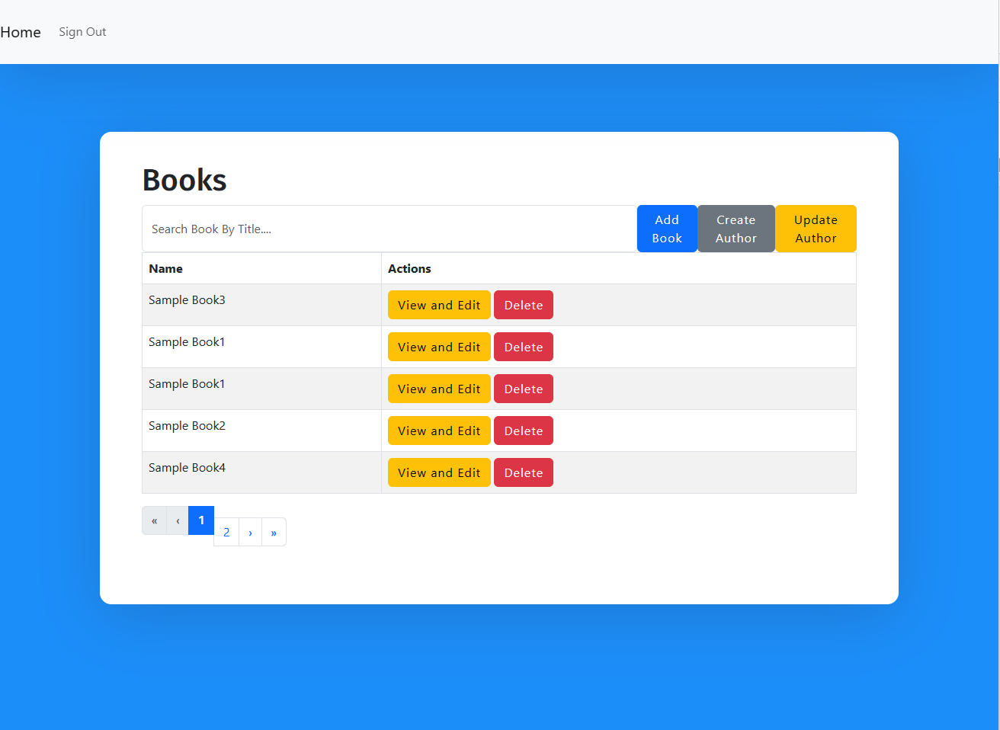
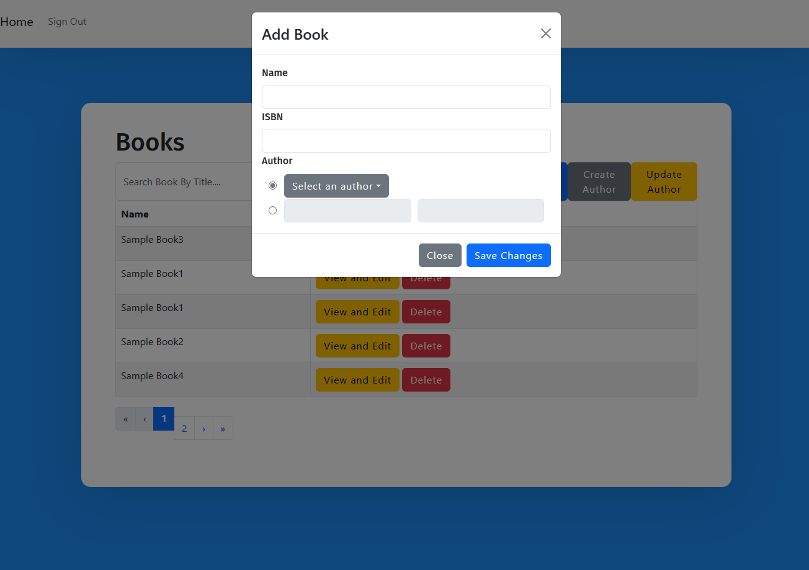
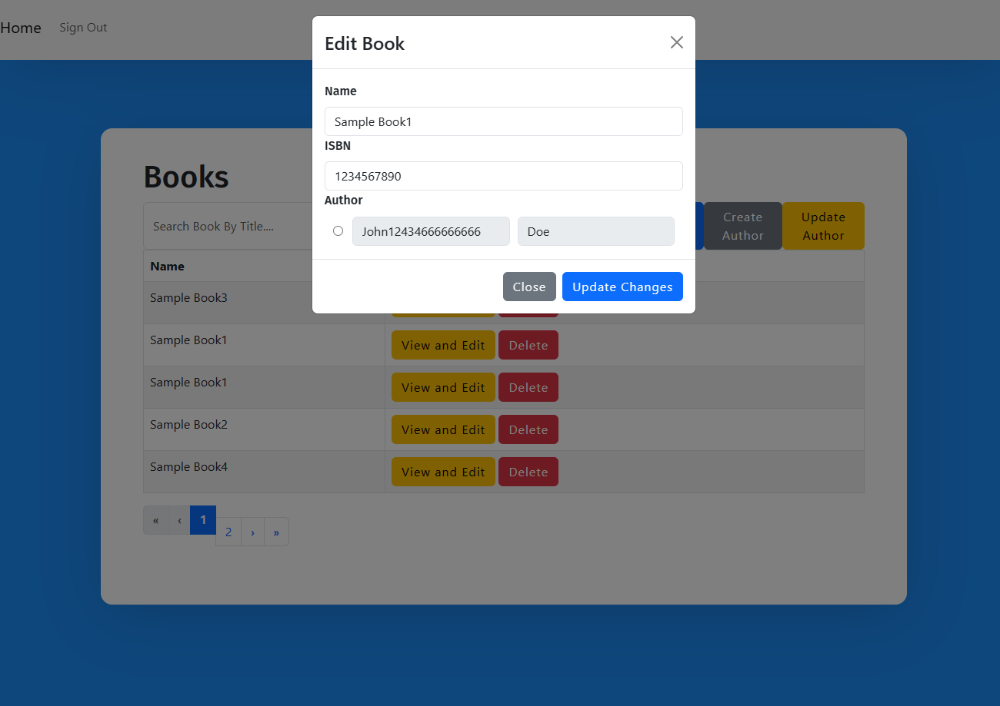
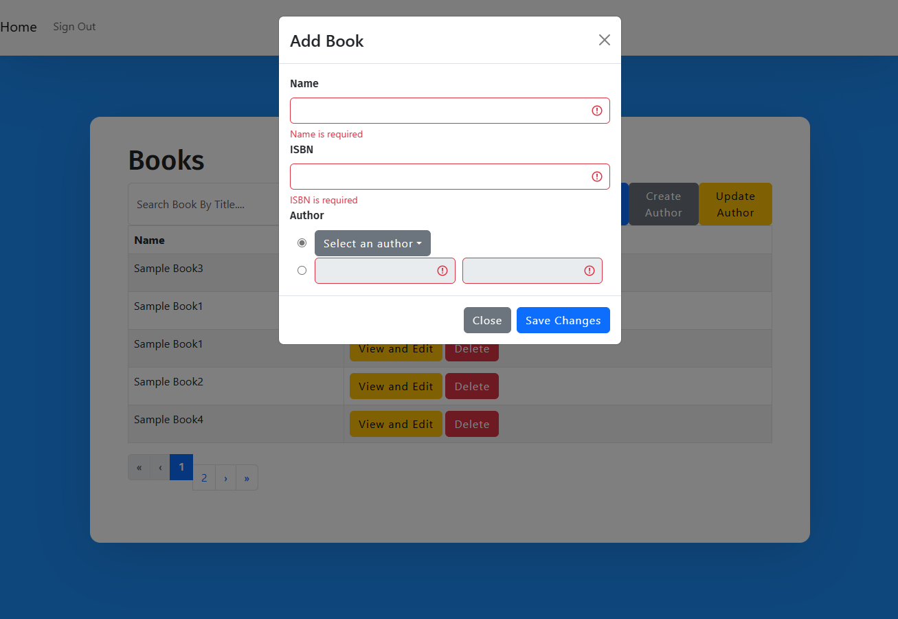
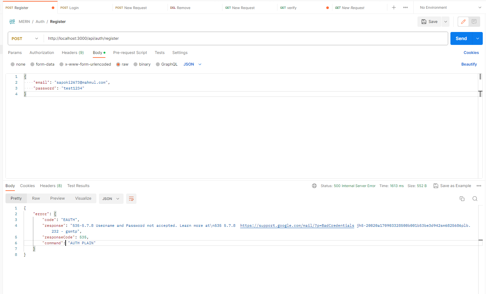

# mern-app
Improvement need:
This is the README file for the Project Name. It contains instructions on how to run the server and the frontend.

## Prerequisites

Before running the application, ensure that you have the following software installed on your machine:

- Node.js
- npm (Node Package Manager)

## Installation

1. Clone the repository to your local machine. (From <span style="font-size: larger; color: red">*</span>main branch)
2. Navigate to the project directory.
3. Install the dependencies for the server by running the following command:

```bash
npm install
```

## Run both the server and the frontend

```bash
npm run start
```


## Run Test on server

```bash
npm test  // Go to the server and run the test
```

if the server runs on the different port you need to chnage that port in <span style="font-size: larger; color: red">*</span>"web-app/src/constants/config.ts"

# Screenshots of the UIs

1. Sign In
   
2. Sign Up
   
3. Table View
   
4. Add Book View
   
5. Edit Book View
   
6. Validation
   
7. Edit Author
   
8. Add Author  [<span style="font-size: larger; color: red">*</span>There are two ways to add authors]
   
   


## Signup Functionality

The signup functionality allows users to create an account. However, currently, there is an `<mark>`issue with the email service that prevents the successful delivery of confirmation emails. As a result, users may not receive the expected confirmation email.`</mark>`

Error message


Despite the email service issue, Users can proceed to log in using their credentials even without receiving the confirmation email.

I have `<mark>`removed signup UI from webapplication but you can create a user using POSTMAN colleaction.`</mark>`

## Postman collection

[Download Postman Collection](./project_resources/MERN.postman_collection.json)


<span style="font-size: larger; color: red">Improvement need:</span> 
```bash
* This frontend application need some improvement on the field validation. 
* Need to develop confirmation after button click like Add Book, Add Author.
```